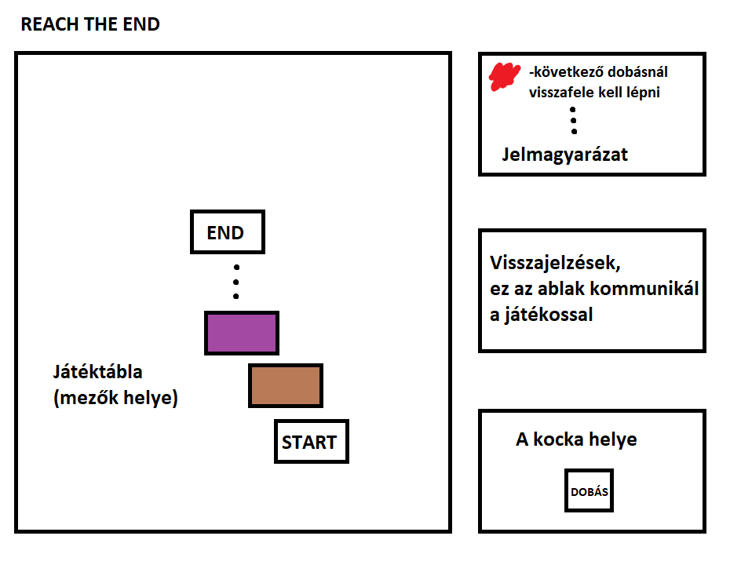

# Reach-The-End

Ez a játék egy klasszikus társajáték élményét nyújtja egy játékos formában.

**Cél:**  Eljutni a start mezőről a célba.

## UI felépítése 

- Játék gombra kattintva elindul a játék
- Az ablak közepén megjelenik a játéktábla
- Jobb felső sarokban megjelenik a táblához tartozó jelmagyarázat
- Jobb alsó sarokban egy dobókocka jelenik meg, az alatta található gomb lenyomásával lehet dobni és lépni
- A jobb oldalt középen található ablakban a játékos álal meghozandó döntések ugranak fel és kommunikál is vele 

## Játéktábla felépítése

- Több mint 100 mező
- A játékos dob egy dobókockával és annak megfelelően lép
- Elágazások: A játékos dönthet hogy merre akar menni
- Különböző színű mezők különböző effecteket adnak
- Utóbbiak különböző minigameket is indíthatnak amelyek teljesítése befolyásolja a tovább jutást

## Jelmagyarázat

- Fehér: Üres mező
- Piros: Következő dobásnál visszafele kell lépni
- Zöld: Következő dobásnál dupla annyit kell lépni
- Lila: A játékos választhat hogy előre vagy hátra akar menni következő dobásnál
- Narancs: Szám kitaláló
- Citrom: Memória játék
- Barna: Verjük a vakondot
- Kék: Aknakereső

## Minigamek

**Számkitaláló:**
- Meg kell tippelni a számot 1 és 100 között amire a játék gondolt
- Kapsz visszajelzést hogy a szám nagyobb vagy kisebb
- Ha a játékos kitalája 6 vagy kevesebb próbálkozásból tovább mehet, ellenkező esetben visszafele kell lépnie

**Memória játék**
- 18 kiterített kártyalap között 6 pár van elrejtve
- A játékra 30 mp áll rendelkezésre
- Ahány párat megtalál a játékos annyit mehet előre kockadobás helyett
- Ha egyet sem talál egy akkor a kockadobás értékének megfelelően kell hátra lépni

**Verjük a vakondot**

- 7 lyukban véletlenszerűen vakondok és bombák bukkannak fel rövid időre
- A játékos a vakondokra kattintva szerezhet pontokat
- Bombára kattintva véget ér a játék és a játékost 6 mezővel hátra dobja
- Ha a játékos 10 vakondot le tud ütni 30 mp alatt a dobásának duplájával mehet tovább
- Ha lejár az ideje akkor dobásának felével (felfele kerekítve) megy tovább

**Aknakereső**

- Egy 8x8 as felületen 10 bomba van elrejtve
- Klasszikus minesweeper szabályok alapján kell megkeresni a bombákat
- Egy bomba helyes megjelölése esetén hatástalanítottnak számít
- Bomba hibás felfedése esetén minden nem hatástalanított bomba robban, ezek számának megfelelő mezőt kell hátra lépni
- Minden bomba hatástalanítása esetén a következő dobás értékénél 6-tal többet léphet a játékos

## Játék vázlata

 
